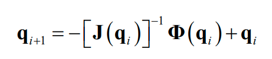

## This repository consist of arduino and matlab codes for controling a 5 bar mechanism cnc machine, and some matlab codes to calculate forces and stress on the joints and bars. 

### Note "Control_para_inventiva" is the most updated code that controls the cnc machine using 4 arrays two for motor steps and two for the speeds to mantains a constant total speed in the X and Y plane. 

### The matlab codes that calculate coordinates are "Calculadora-coordenadas..."  "Calculadora-coordenadas_r6_theta6.m" is the one that generates the 4 arrays needed for the arduino code.

### "Calculadora-coordenadas_r6_theta6.m" uses "Gen_coordenadas.m" to generate coordniates based on polar calculus functions and the other two codes generate positions for the machine mechanism based on a seed "q=[]" (Keep in mind "q=[]" is the array of results)

### The coordinates of the mechanism are calculates using the Jacobian Matrix since it is a system of non linear equations. Jacobian matrix is a matrix of partial derivatives and the Newton Raphson is a powerful technique for solving equations numerically.

* A presentation on the Jacobian method for mechanisms <a href="https://www.slideserve.com/kendis/properties-of-the-jacobian-powerpoint-ppt-presentation">Presentation Here</a>

* Newton Raphson:

* Resulting formula: 

